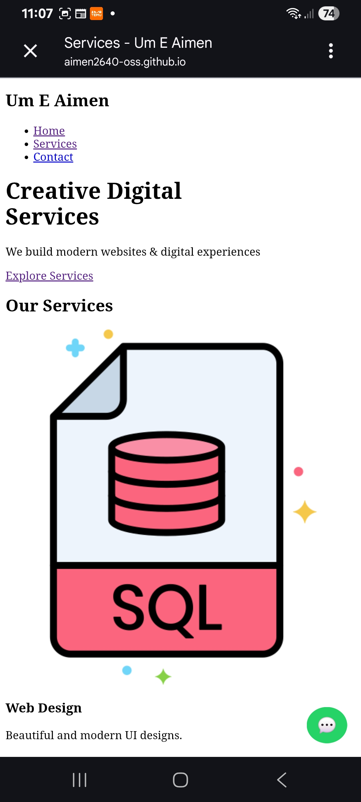
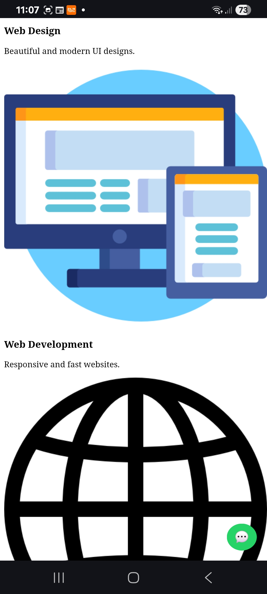
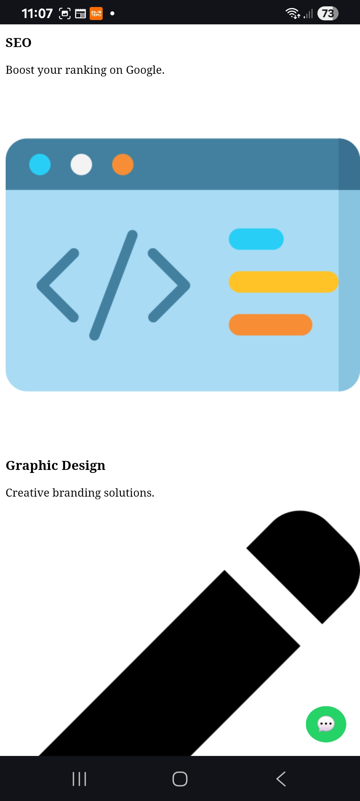

# 🌐 Services Page Project

## 👩‍💻 Created By:
**Um E Aimen**

## 📌 Project Description
This is a responsive Services Page designed using HTML, CSS, and JavaScript.  
It showcases different services with a modern UI and smooth animations.

## 🚀 Features
- Responsive design (Mobile, Tablet, Desktop)
- Hero section with CTA
- Services cards with hover effects
- Testimonials section
- Contact form (Email integration)
- Smooth scrolling and animations
- WhatsApp contact button

## 🛠 Technologies Used
- HTML5
- CSS3
- JavaScript
- EmailJS (for contact form)

## 📱 Live Website
(https://aimen2640-oss.github.io/service-page-/)

## 📸 Screenshot

## 📩 Contact
Email: uzairahmed2640@gmail.com

---
⭐ This project is created as part of a Web Designer Internship Task.
